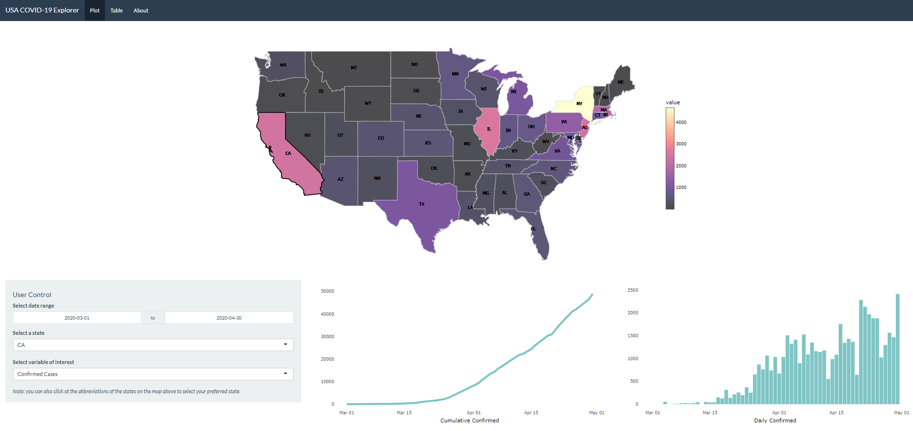

```{r setup, include=FALSE}
knitr::opts_chunk$set(echo = FALSE)
```

Last week, I created a Shiny app as a part of an assignment in Communicating with Data course.
In order to meet the requirement of the assignment, the app needs to give users a degree of freedom
to explore data related to COVID-19. [USA COVID-19 Explorer](https://github.com/etc5523-2020/shiny-assessment-j-effendy), 
the Shiny app that I created, allows users to gain insights about the spread of COVID-19 in the US. 
It provides users with a number of interactive graphs and table where users can control what 
variable of interests to be displayed. 

These are the variables that users can control:

* Date range: ranging from 1st of March to 7th of October 2020.
* State: a list of states in the US.
* Statistics: daily or cumulative
* Variable of interest: number of confirmed cases, deaths, tests, and recovered.



## Self Review

### What Went Well

The app separates its contents to three pages - plot, table, and about. 
One of the purpose of this is to prevent the app to be overcrowded by plots and table.
The contents of the app are divided across these pages based on their functions.
One page is dedicated to interactive plots as graphs allows users to easily identify
patterns and trends of a dataset. If the users wish to explore the data in greater
details, they can use the interactive table provided in the table page.

The plots provided in the app are related to what arguably are the two most important 
metrics/statistics in COVID-19 data: cumulative and new daily cases. In addition,
the color scales used for the map are specifically chosen to assist people with colorblindness.
The app also provides users with an appropriate degree of control in interacting with both
plots and tables.

### Rooms for Improvement

One of the limitations that the app has is the processing time it takes to respond to user input
for the plots. Furthermore, while the app itself is self-explanatory, a quick 
introduction about what each page aim to accomplish is a nice addition to add. Another limitation
of the app is that it often crashes when the users do not click at the correct area of the map (the map
will only respond if the users click the name/abbreviation of the states).

### Plausible Addition

One great plausible addition for the app is the incorporation of CSS (Cascading Style Sheet). This
would have made the app more visually appealing to the users. Moreover, using bubbles on the map
to show the number of cases on each state would be a great visualisation feature for the app. A map from leaflet
would also make great improvements to the app. Not only will this make the app much more visually 
appealing to users, it will also allow the app to compare COVID-19 cases across different
countries and present it in a map.

### Great Additions but not yet Possible

Other information that would be great for the app is background health information of each cases
(e.g. smokers, diabetic, or other health or lifestyle characteristics). These types of information will be
useful as users will be able to see whether people with certain lifestyle or health characteristics
are more prone to the virus. While this information is useful, it is difficult to find (if any)
data set with this type of information comprehensively. One of the reasons behind this limited data may be
due to privacy concerns.

Another great addition to the app is worldwide COVID-19 dataset with state-level information.
This will give users a greater level of details of COVID-19 spread around the world.
However, it is difficult to find dataset that contain information at the state-level other
than the US and China. Most dataset only offers COVID-19 data at national level.
