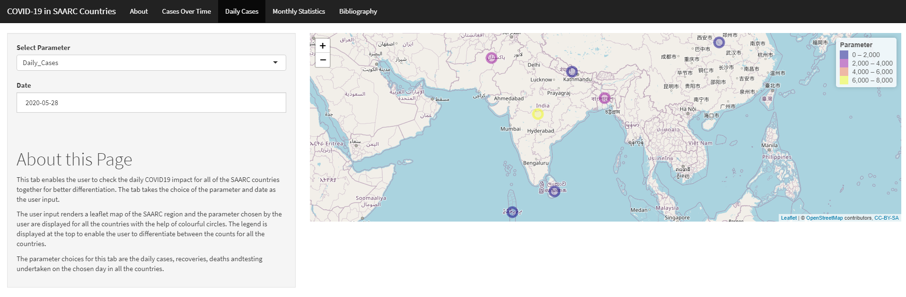

```{r setup, include=FALSE}
knitr::opts_chunk$set(echo = FALSE)
```

## Introduction

Last week, we were required to create an R package as a part of
ETC5523 Communicating with Data subject. In today's blog post, 
I am going to review a package that was created by one of my 
colleagues and reflect on how others overcome similar challenges
that I had. The package that I am reviewing today is called 
[`covidasia`](https://github.com/etc5523-2020/r-package-assessment-Siddhant-96),
and it is developed by Siddhant Tirodkar. The package embeds a shiny app called 
*COVID-19 in SAARC Countries* where it  provides a comprehensive summary of 
COVID-19 spread in major Asian countries. 




## The Package

The package can be installed and run as specified in the instruction from 
README in Github without problem. The app also run well, and it generally
responds well to users' input. The app utilises a line plot, 
a map plot, and interactive tables to provide users with cumulative, 
daily, and monthly statistics. These plots and table are housed in a page
and are accompanied by a short description. The plots and table are interactive
based on users' input (e.g. users can select specific parameter or date range
to be presented in the plots or table).

The countries included in this package are:

* India
* Pakistan
* China
* Bangladesh
* Nepal
* Sri Lanka
* Maldives

A vignette was provided by the package, and it can be found 
[here](https://etc5523-2020.github.io/r-package-assessment-Siddhant-96/).
Moreover, further documentations are also provided for all the three functions
provided by the package, and it can be found locally (e.g. `?covidasia::launch_app()`).
Lastly, there are two unit tests deployed in the package, and the package
successfully pass these tests.

## Room for Improvement

While it can be installed and run without difficulty, there is definitely a
room for improvement for the package. Firstly, the line plot and interactive
table do not respond to users input for country.


Another aspect of the package that can be improved is its documentations.
While vignettes and readme documents are provided, it would have been 
better if the background, specific functionality, and overview
of the package are more thoroughly explained/described in the documentations.
Moreover, while the package successfully passed the tests, there are six warnings
produced by the tests.


## Wrap-up

Overall, `covidasia` is a solid package that has rooms for improvement especially
in the documentations area. I personally like the way the app dedicates one page to 
each plots/table. This prevents the page in the shiny app to be overcrowded by contents.
Moreover, the app is very easy to use thanks to instructions dedicated on each page.

# Appendix

## Package Review

*Please check off boxes as applicable, and elaborate in comments below.  Your review is not limited to these topics, as described in the reviewer guide*

- **Briefly describe any working relationship you have (had) with the package authors.**
- [x] As the reviewer I confirm that there are no [conflicts of interest](https://devguide.ropensci.org/policies.html#coi) for me to review this work (If you are unsure whether you are in conflict, please speak to your editor _before_ starting your review).

#### Documentation

The package includes all the following forms of documentation:

- [x] **A statement of need** clearly stating problems the software is designed to solve and its target audience in README
- [x] **Installation instructions:** for the development version of package and any non-standard dependencies in README
- [ ] **Vignette(s)** demonstrating major functionality that runs successfully locally
- [x] **Function Documentation:** for all exported functions in R help
- [ ] **Examples** for all exported functions in R Help that run successfully locally
- [x] **Community guidelines** including contribution guidelines in the README or CONTRIBUTING, and DESCRIPTION with `URL`, `BugReports` and `Maintainer` (which may be autogenerated via `Authors@R`).

>##### For packages co-submitting to JOSS
>
>- [ ] The package has an **obvious research application** according to [JOSS's definition](https://joss.theoj.org/about#submission_requirements)
>
>The package contains a `paper.md` matching [JOSS's requirements](https://joss.theoj.org/about#paper_structure) with:
>
>- [ ] **A short summary** describing the high-level functionality of the software
>- [ ] **Authors:**  A list of authors with their affiliations
>- [ ] **A statement of need** clearly stating problems the software is designed to solve and its target audience.
>- [ ] **References:** with DOIs for all those that have one (e.g. papers, datasets, software).

#### Functionality

- [x] **Installation:** Installation succeeds as documented.
- [x] **Functionality:** Any functional claims of the software been confirmed.
- [x] **Performance:** Any performance claims of the software been confirmed.
- [x] **Automated tests:** Unit tests cover essential functions of the package
   and a reasonable range of inputs and conditions. All tests pass on the local machine.
- [x] **Packaging guidelines**: The package conforms to the rOpenSci packaging guidelines

Estimated hours spent reviewing:

- [ ] Should the author(s) deem it appropriate, I agree to be acknowledged as a package reviewer ("rev" role) in the package DESCRIPTION file.
